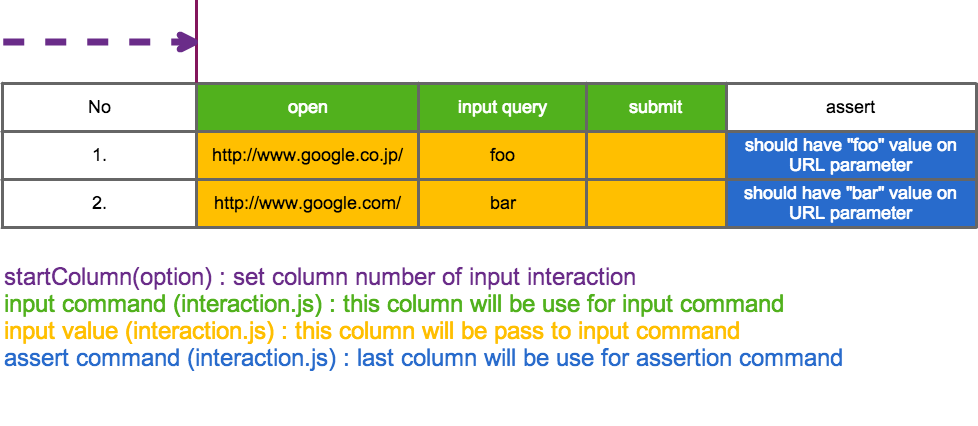

# WebDriver for combitorial testing[](https://travis-ci.org/sideroad/wd-ct) [](https://coveralls.io/r/sideroad/wd-ct?branch=master) [](https://codeclimate.com/github/sideroad/wd-ct)
[](https://saucelabs.com/u/wdct)

## Overview
### testcase


### interaction script


## Getting Started

```sh
$ npm install -g wd-ct
$ wd-ct -s
Are you sure you want to generate testcase? (y / n)
> (n) y
Input testcase file name.( csv, xls, xlsx extension is permitted )
> (testcase.csv) 
Are you sure you want to generate interaction.js? (y / n)
> (n) y
Input interaction script name
> (interaction.js) 
Input source of testcase
> (testcase.csv) 
```

### Usage
```sh
$ wd-ct --help

##############################################
#  ██╗    ██╗██████╗        ██████╗████████╗ #
#  ██║    ██║██╔══██╗      ██╔════╝╚══██╔══╝ #
#  ██║ █╗ ██║██║  ██║█████╗██║        ██║    #
#  ██║███╗██║██║  ██║╚════╝██║        ██║    #
#  ╚███╔███╔╝██████╔╝      ╚██████╗   ██║    #
#   ╚══╝╚══╝ ╚═════╝        ╚═════╝   ╚═╝    #
##############################################

Usage: node /Users/sideroad/workspace/wd-ct/bin/wd-ct [options]
Display usage
    -h, --help
Continue to execute test even though error occurred
    -f, --force
Capture page when error occurred. please set captured image directory path
    -es, --error-screenshot <value>
Use saucelabs ( Please set SAUCE_USERNAME, SAUCE_ACCESS_KEY environment before execute )
    -sl, --saucelabs
Execute only specified row number test
    -rn, --rownum <value>
Interation start column index number should be set
    -sc, --start-column <value>
Pause on error
    -pe, --pause-on-error
Stepwise execution
    -sw, --stepwise
Generate interaction script and testcase file from template
    --scaffold
Not apply color to console
    -nc, --no-color
Browser ( comma separatted )
    -b, --browsers <value>
Not output logging
    -nl, --no-logging
Prepare stored variable before execution (JSON format)
    --store <value>
Target interaction file
    -i, --interaction <value>
Target testcase file
    -t, --testcase <value>
```

Concreate interaction script and testcase file.

Referrence for interaction as wd and assertion as chai.

- [wd API document](https://github.com/admc/wd/blob/master/doc/api.md)

- [chai document](http://chaijs.com/api/)

- [chai as promise document](http://chaijs.com/plugins/chai-as-promised)

## Advanced

### Store value
When you want to use variable after the command.
wd-ct prepare store object for keeping variable.
Benefit to use store object is to be able to check variable when `break` command executed.
`break` command will be explain in next section.
```js
        return this.get('http://www.google.com/')
                   .url()
                   .then(function(url){
                        store.url = url;
                   })
```

### Debugging

`wd-ct` provides bunch of approach for effective debug

#### Pause options

- Stepwise execution
Will be pause after each command execution
`wd-ct --stepwise ...`

- Break on error
Will be pause when error occurred
`wd-ct --break-on-error ...`

#### Pause command

If you want to pause manually, `break` method can be used for pause.

```js
return this.get('http://www.google.com/')
           .break()  // will be pause on here
           .url()
```

During paused, we can check stored variable on store object.

```js
// interaction.js
// ...
        return this.get('http://www.google.com/')
                   .url()
                   .then(function(url){
                        store.url = url;
                   })
                   .break();
// ...
```

Debugging console log is below.
```sh
Input command or press enter to continue.
> store
{ url: 'https://www.google.co.jp/?gfe_rd=cr&ei=zZX5U-iUJOiT8QequICIBA&gws_rd=ssl' }
Input command or press enter to continue.
> store.url
https://www.google.co.jp/?gfe_rd=cr&ei=zZX5U-iUJOiT8QequICIBA&gws_rd=ssl
Input command or press enter to continue.
> 
```

#### Other options for debug

- Capture page when error occurred
`wd-ct --error-screenshot ...`

- Continue to execute test even though error occurred
`wd-ct --force ...`

### Additional methods

wd-ct provides additional wd methods.
#### fire
Fire event for specified DOM element
```js
return this.elementByCss('#foo')
           .fire('change')
```

#### naturalType
This is a alias to emulate typing below
```js
return this.elementByCss('input[type="text"]')
           .naturalType('foo')
```
is same as 
```js
return this.elementByCss('input[type="text"]')
           .fire('focus')
           .clear()
           .type('foo')
           .fire('change')
           .fire('blur')
```

#### select
select option of selectbox
```js
return this.elementByCss('#selectbox')
           .select('banana')
```